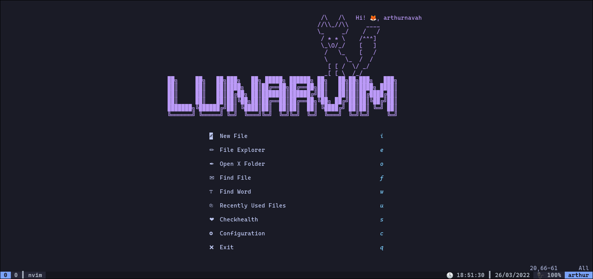

# 🦊 environment 🦊

Development environment with terminal, with [Alacritty](https://alacritty.org/), [Tmux](https://github.com/tmux/tmux), [Zsh](https://github.com/zsh-users/zsh) and [Vim](https://github.com/vim/vim). ([Screenshots](./screenshots/README.md))

**This environment uses [LunarVim](https://www.lunarvim.org/), so the editor command is: `lvim`**

**The borderless window is moved by holding down `<Super>` (Window Key) and dragging with the mouse**

_Have `npm`, `node` and `cargo` installed on your system_

_**[:scroll: Tutorials here :scroll:](./docs/README.md)**_

#### Table of Contents

1. **[:ballot_box_with_check: Features :ballot_box_with_check:](#ballot_box_with_check-features-ballot_box_with_check)**
2. **[:sparkles: Installation :sparkles:](#sparkles-installation-sparkles)**
3. **[:information_source: After installation :information_source:](#information_source-after-installation-information_source)**
4. **[Requirements](#requirements)**
5. **[:arrows_clockwise: Update :arrows_clockwise:](#arrows_clockwise-update-arrows_clockwise)**
5. **[:gear: Custom configuration :gear:](#gear-custom-configuration-gear)**
6. **[:keyboard: More keyboard speed :keyboard:](#keyboard-more-keyboard-speed-keyboard)**
6. **[:warning: Precaution :warning:](#warning-precaution-warning)**
6. **[:heart: LunarVim Checkhealth :heart:](#heart-lunarvim-checkhealth-heart)**
7. **[Reminders](#reminders)**

## :ballot_box_with_check: Features :ballot_box_with_check:
_Screenshots of the environment in [screenshots/](./screenshots/README.md)_

* **True Color** :rainbow:

* Nerd Font: [Cascadia Code](https://github.com/microsoft/cascadia-code)

#### Terminal :computer: ([`alacritty`](https://alacritty.org/))

* [`tmux`](https://github.com/tmux/tmux)

	- [Colorscheme](https://github.com/arthurnavah/tmux-arthur-theme)

* [`zsh`](https://github.com/zsh-users/zsh)

	- FzF :mag: (`<Ctrl>r`)

	- Git Plugin :octopus:

	- Syntax highlighting :flashlight::rainbow:

	- Autosuggestions :thought_balloon:

#### Editor :pencil: ([`lvim`](https://www.lunarvim.org/))

* Fast startup time :zap:

* Lazy-load of plugins 🦥

* LSP / Code Completion 🧠:thought_balloon:

	- Installer (`:LspInstall <language>`)

	- Automatic language installation! (config server `:NlspConfig <server>`)

	- Autocomplete signatures

	- Hover documentation (`K`)

	- Snippets

* File search :mag::page_facing_up: (`<Space>f`)

* Word search :mag::abc: (`<Space>j`)

* Linters :flashlight::straight_ruler:

* Formatters 🛠️:straight_ruler:

_**And much more :eyes:**_

## :sparkles: Installation :sparkles:

This repo installs LunarVim, so the editor command is: `lvim`

**This environment is prepared to be installed on Linux Ubuntu, read/adap the installation scripts if you have another distribution/operating system**

```sh
git clone --depth 1 https://github.com/arthurnavah/environment.git

cd environment
bash install.sh all

# or
#  bash install.sh editor console
```

_A `bash install.sh` alone (without parameters), would install only the `editor`_

##### Options

With the `-n` option, Neovim can be installed without the providers

```sh
# example:
bash install.sh -n all
```

## :information_source: After installation :information_source:

Run `:PackerSync` in `lvim`

Open `lvim` and wait for [Treesitter](https://github.com/nvim-treesitter/nvim-treesitter) to install the modules

_The first few lines of the [LunarVim configuration file](./config/config.lua) show some commands to be executed_

## Requirements

* `go` >= _v1.15.0_
* `node` >= _v12.0.0_

	- `npm`

* `rust`

	- `cargo`

## :arrows_clockwise: Update :arrows_clockwise:

This is recommended if you were already using this configuration and just want to get the latest configuration

```sh
git clone https://github.com/arthurnavah/environment.git

cd environment
bash update.sh all

# or
#  bash update.sh editor console
```

_A `bash update.sh` alone (without parameters), would update only the `editor`_

## :gear: Custom configuration :gear:

To add custom configurations do it in the `~/.lunarvim.lua` file

For example, to add more plugins would be:
```lua
-- add plugin vim-fugitive
vim.list_extend(lvim.plugins,
	{
		"folke/lsp-colors.nvim",
		event = "BufRead",
	}
)

-- change leader key
lvim.leader = ","

-- change theme
lvim.colorscheme = "onedarker"
```

## :keyboard: More keyboard speed :keyboard:

If with `Ctrl-Alt-F3` you go to another terminal without graphic interface and use Vim you will notice that the movement speed is higher, this is because our graphic server configures the "delay rate" and "repeat rate" of our keyboard with "slower" values... these are the values of how much we must wait for a key to repeat and how much it repeats

When I noticed this I felt very slow in Vim, you can change the delay and repeat rate with the following command:

```sh
xset r rate 200 30
# to make it permanent, write in ~/.zshrc (backup first for safety)
```

_(This configuration already integrates this command in [.zshrc.arthurnavah](./config/.zshrc.arthurnavah))_

## :warning: Precaution :warning:

Read [`install.sh`](./install.sh) file before running on your system

These instructions and the [`install.sh`](./install.sh) file will replace your configuration files for these tools, please keep this in mind

```sh
# Configuration backup
cp ~/.config/alacritty/alacritty.yml ~/.config/alacritty/alacritty.yml.copy
cp ~/.zshrc ~/.zshrc.copy
cp ~/.tmux.conf ~/.tmux.conf.copy
cp ~/.config/lvim/config.lua ~/.config/lvim/config.lua.copy
cp ~/.golangci.yml ~/.golangci.yml.copy
```

## :heart: LunarVim Checkhealth :heart:

```sh
lvim +checkhealth
```

## Reminders

* Execute the required commands when installing this environment ([read ~/.config/lvim/config.lua](./config/config.lua))

* The first save (`:w`) when installing this environment is slow, since it is caching.

## Light Mode (outdated)

To activate the 'light mode' execute the command `lightmode` or the alias `li`. To return to 'dark mode' execute the command `darkmode` or the alias `da`

To change mode in Vim run `:LightMode` or `:DarkMode`
