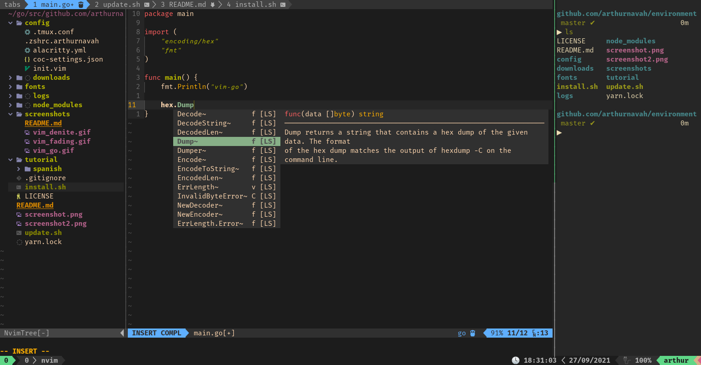
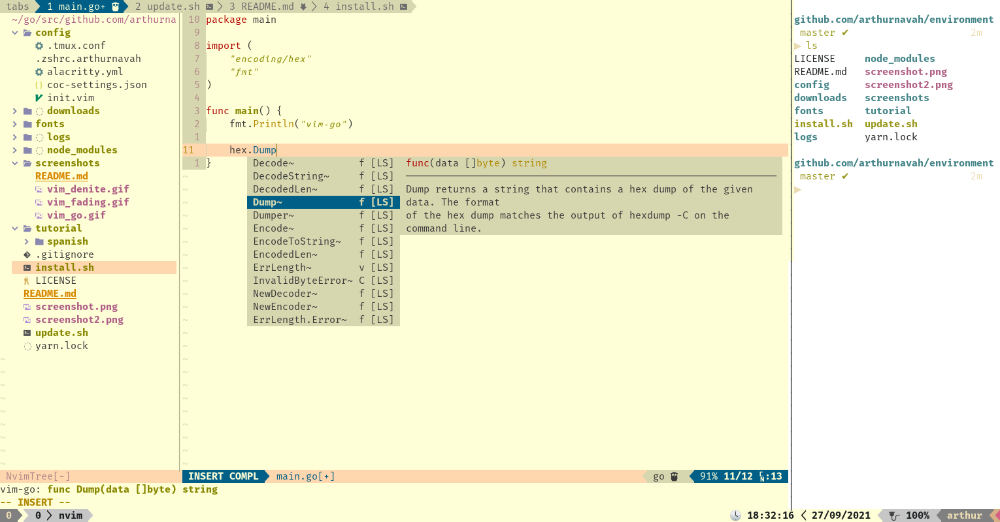

# environment

Personal Terminal Development Environment, with Zsh, Tmux and Vim. (Screenshots of the environment in [screenshots](./screenshots/README.md))

[Golang/$GOPATH](https://golang.org/) for development tools and [NodeJS](https://nodejs.org/) for [`coc.nvim`](https://github.com/neoclide/coc.nvim) are required.

-   [`alacritty`](https://github.com/alacritty/alacritty)

-   [`zsh`](https://github.com/zsh-users/zsh)

    -   [Oh My ZSH!](https://github.com/ohmyzsh/ohmyzsh)
    -   [zsh-syntax-highlighting](https://github.com/zsh-users/zsh-syntax-highlighting)
    -   [zsh-autosuggestions](https://github.com/zsh-users/zsh-autosuggestions)

-   [`tmux`](https://github.com/tmux/tmux)

    -   [Tmux Plugin Manager](https://github.com/tmux-plugins/tpm)
    -   [tmux-yank](https://github.com/tmux-plugins/tmux-yank)
    -   [tmux-arthur-theme](https://github.com/arthurnavah/tmux-arthur-theme)
    -   [Tmux battery status](https://github.com/tmux-plugins/tmux-battery)

-   [`neovim`](https://github.com/neovim/neovim)

    -   Read [config/vimrc](./config/vimrc) ...

-   [Powerline fonts](https://github.com/powerline/fonts)
    -   Fira Mono
    -   Ubuntu Mono

## Installation

```sh
git clone https://github.com/arthurnavah/environment.git

cd environment
bash install.sh all

# or
#  bash install.sh editor console
```

A `bash install.sh` alone (without parameters), would install only the `editor`.

### Options

With the `-n` option, Neovim can be installed without the providers.

```sh
# example:
bash install.sh -n all
```

## Update

If you already have Neovim (With [dein.vim](https://github.com/Shougo/dein.vim)), Tmux (With [TPM](https://github.com/tmux-plugins/tpm)) and Zsh (With Oh My Zsh) you just need to copy the configuration.

This is recommended if you were already using this configuration and just want to get the latest configuration.

```sh
git clone https://github.com/arthurnavah/environment.git

cd environment
bash update.sh all

# or
#  bash update.sh editor console
```

A `bash update.sh` alone (without parameters), would update only the `editor`.

### Neovim Checkhealth

```sh
nvim +checkhealth
```

## 💨⚡ More speed? ⚡💨

If with `Ctrl-Alt-F3` you go to another terminal without graphic interface and use Vim you will notice that the movement speed is higher, this is because our graphic server configures the "delay rate" and "repeat rate" of our keyboard with "slower" values... these are the values of how much we must wait for a key to repeat and how much it repeats.

When I noticed this I felt very slow in Vim, you can change the delay and repeat rate with the following command:

```sh
xset r rate 200 30
# to make it permanent, write in ~/.zshrc (backup first for safety)
```

_(This configuration already integrates this command in .zshrc)_

## FAQ - Errors

### Why do I have double results in the autocomplete?

Probably before using this configuration, you had more extensions for [`coc.nvim`](https://github.com/neoclide/coc.nvim), run `:CocList extensions` and `:CocList services` to confirm it.

This configuration uses [`gopls`](https://pkg.go.dev/golang.org/x/tools/gopls) for autocompletion in [Golang](https://golang.org/), having the [`coc-go`](https://github.com/josa42/coc-go) extension could cause double results.

You can uninstall extensions with `:CocUninstall <extensionName>`.

## ⚠️ Precaution ⚠️

Read [`install.sh`](./install.sh) file before running on your system.

These instructions and the [`install.sh`](./install.sh) file will replace your configuration files for these tools, please keep this in mind.

```sh
# Configuration backup
cp ~/.config/alacritty/alacritty.yml ~/.config/alacritty/alacritty.yml.copy
cp ~/.zshrc ~/.zshrc.copy
cp ~/.tmux.conf ~/.tmux.conf.copy
cp ~/.config/nvim/init.vim ~/.config/nvim/init.vim.copy
cp ~/.config/nvim/coc-settings.json ~/.config/nvim/coc-settings.json.copy
```

## Light Mode

To activate the 'light mode' execute the command `lightmode` or the alias `li`. To return to 'dark mode' execute the command `darkmode` or the alias `da`.

To change mode in Vim run `:LightMode` or `:DarkMode`.


