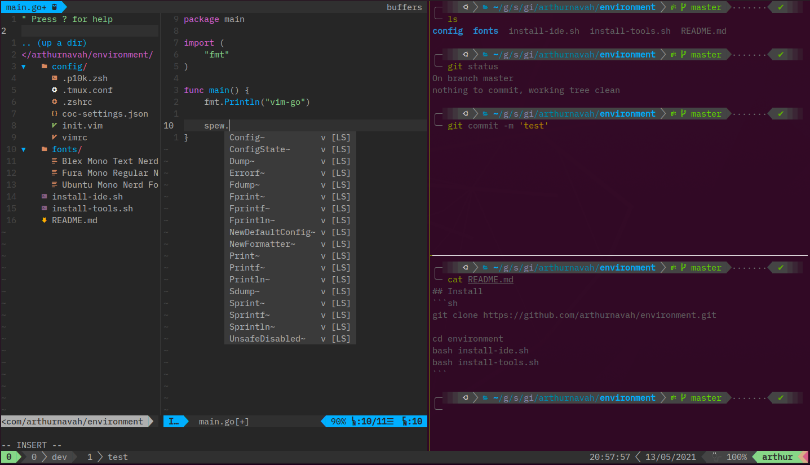
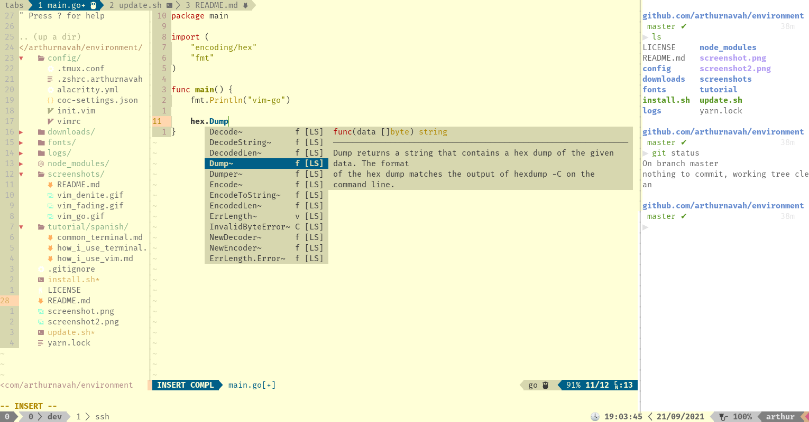

# environment
Personal Terminal Development Environment, with Zsh, Tmux and Vim.

[Golang/$GOPATH](https://golang.org/) for development tools and [NodeJS](https://nodejs.org/) for [`coc.nvim`](https://github.com/neoclide/coc.nvim) are required.

* [`alacritty`](https://github.com/alacritty/alacritty)

* [`zsh`](https://github.com/zsh-users/zsh)
    * [Oh My ZSH!](https://github.com/ohmyzsh/ohmyzsh)
    * [zsh-syntax-highlighting](https://github.com/zsh-users/zsh-syntax-highlighting)
    * [zsh-autosuggestions](https://github.com/zsh-users/zsh-autosuggestions)

* [`tmux`](https://github.com/tmux/tmux)
    * [Tmux Plugin Manager](https://github.com/tmux-plugins/tpm)
    * [Tmux sensible](https://github.com/tmux-plugins/tmux-sensible)
    * [Tmux Resurrect](https://github.com/tmux-plugins/tmux-resurrect)
    * [tmux-continuum](https://github.com/tmux-plugins/tmux-continuum)
    * [tmux-yank](https://github.com/tmux-plugins/tmux-yank)
    * [tmux-onedark-theme](https://github.com/arthurnavah/tmux-onedark-theme)
    * [Tmux battery status](https://github.com/tmux-plugins/tmux-battery)

* [`neovim`](https://github.com/neovim/neovim)
    * Read [config/vimrc](./config/vimrc) ...

* [Nerd fonts](https://github.com/ryanoasis/nerd-fonts)
    * Blex Mono
    * Fura Mono
    * Ubuntu Mono

## Complete installation
```sh
git clone https://github.com/arthurnavah/environment.git

cd environment 
bash install.sh editor console

# or
#  bash install.sh all
```

### Options
With the `-n` option, Vim can be installed without the providers.
```sh
bash install.sh -n editor console
```

## Migration
If you already have Neovim (With [dein.vim](https://github.com/Shougo/dein.vim)), Tmux (With [TPM](https://github.com/tmux-plugins/tpm)) and Zsh (With Oh My Zsh) you just need to copy the configuration

```sh
git clone https://github.com/arthurnavah/environment.git

cd environment 

cp config/alacritty.yml ~/.config/alacritty/.
cp config/.zshrc ~/.
cp config/.tmux.conf ~/.

cp config/vimrc ~/.vim/.
cp config/init.vim ~/.config/nvim/.
cp config/coc-settings.json ~/.config/nvim/.
```

### Install Plugins and Tools
```sh
# Neovim
nvim --headless +"call dein#install()" +qall
nvim --headless +"call dein#update()" +qall
nvim --headless +UpdateRemotePlugins +qall
nvim --headless +GoInstallBinaries +qall
nvim --headless +GoUpdateBinaries +qall
nvim --headless +CocUpdate +qall

# Tmux
bash ~/.tmux/plugins/tpm/scripts/install_plugins.sh
```

### Neovim Checkhealth
```sh
nvim +checkhealth
```

## FAQ - Errors

### Why do I have double results in the autocomplete?
Probably before using this configuration, you had more extensions for [`coc.nvim`](https://github.com/neoclide/coc.nvim), run `:CocList extensions` and `:CocList services` to confirm it.

This configuration uses [`gopls`](https://pkg.go.dev/golang.org/x/tools/gopls) for autocompletion in [Golang](https://golang.org/), having the [`coc-go`](https://github.com/josa42/coc-go) extension could cause double results.

You can uninstall extensions with `:CocUninstall <extensionName>`.

## ⚠️  Precaution ⚠️
Read [`install.sh`](./install.sh) file before running on your system.

These instructions and the [`install.sh`](./install.sh) file will replace your configuration files for these tools, please keep this in mind.
```sh
# Configuration backup
cp ~/.config/alacritty/alacritty.yml ~/.config/alacritty/alacritty.yml.copy
cp ~/.zshrc ~/.zshrc.copy
cp ~/.tmux.conf ~/.tmux.conf.copy
cp ~/.vim/vimrc ~/.vim/vimrc.copy
cp ~/.config/nvim/init.vim ~/.config/nvim/init.vim.copy
cp ~/.config/nvim/coc-settings.json ~/.config/nvim/coc-settings.json.copy
```

## Light Mode
To activate the 'light mode' execute the command `lightmode` or the alias `li`. To return to 'dark mode' execute the command `darkmode` or the alias `da`.

To change mode in Vim run `:LightMode` or `:DarkMode`.


