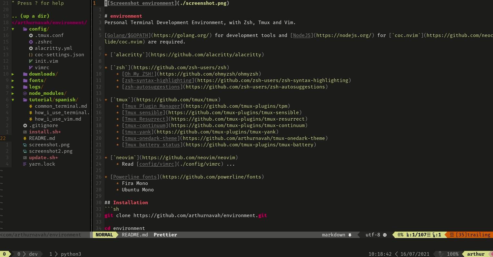
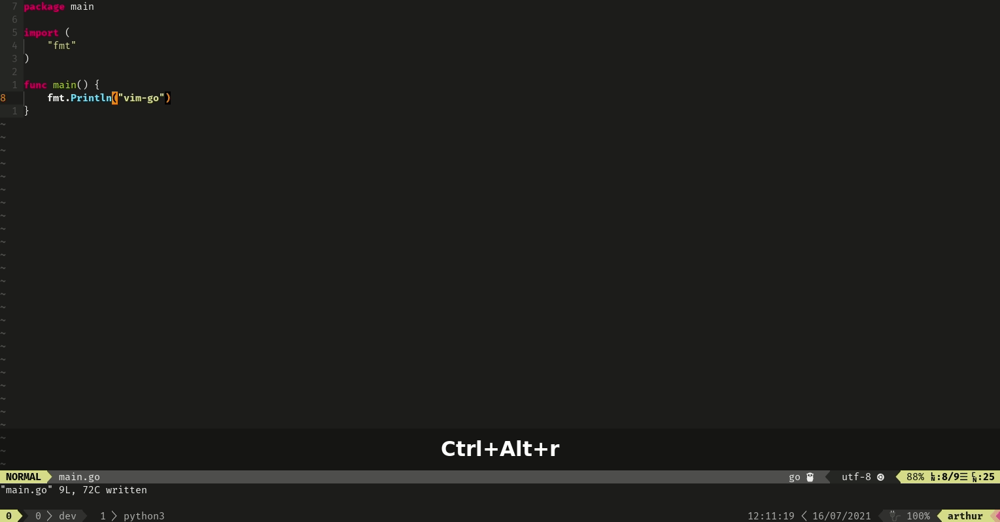
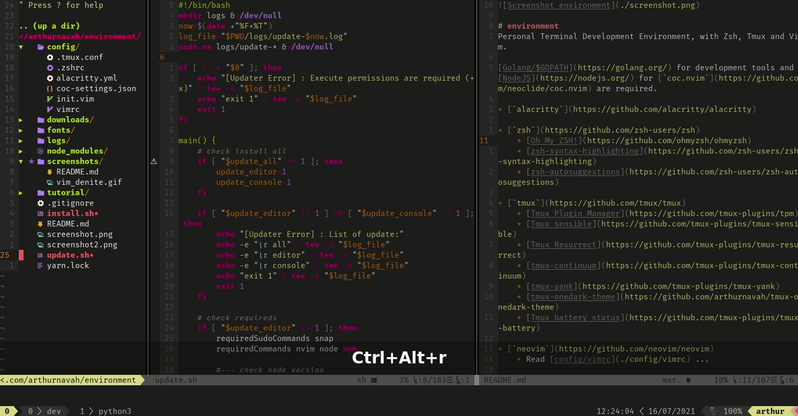

# Screenshots of the environment

## Vim

### File search window ([`Denite`](https://github.com/Shougo/denite.nvim))

### Autocomplete ([`coc.nvim`](https://github.com/neoclide/coc.nvim))

### Fading of inactive panels ([`vimade`](https://github.com/TaDaa/vimade))

