# Screenshots of the environment

## Vim
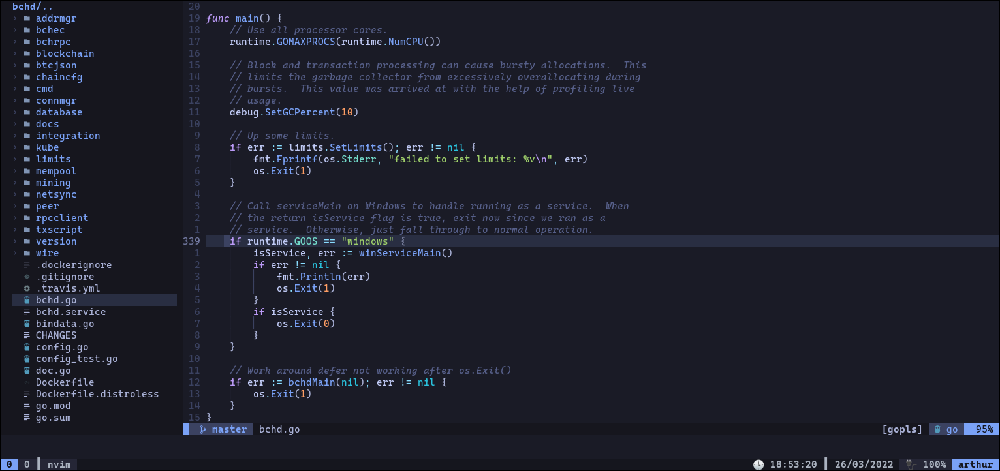

### Autocomplete
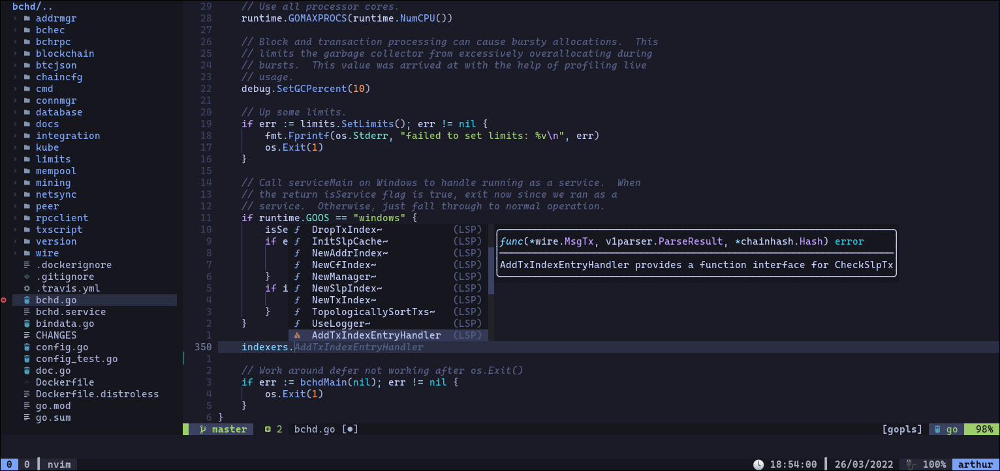

#### Autocomplete Signatures / Placeholders
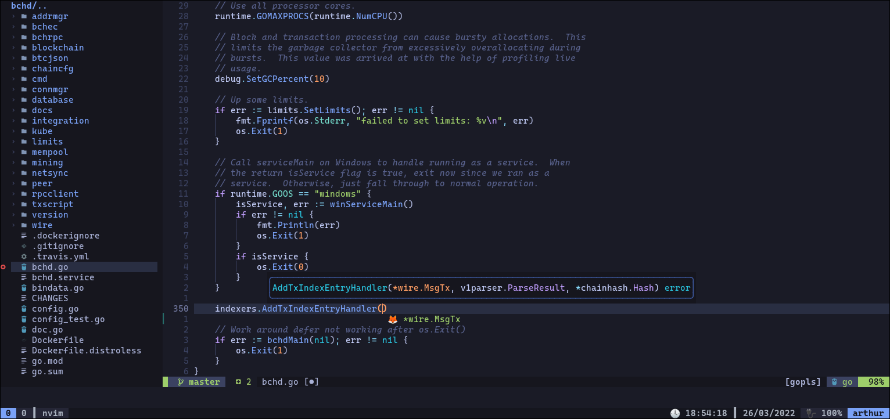

### Hovers (`K`)
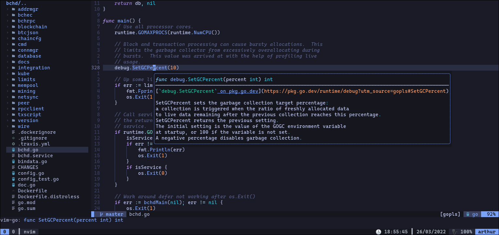

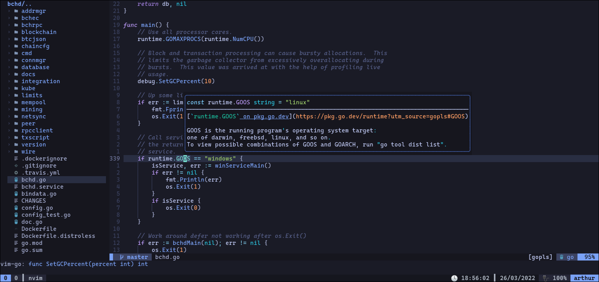

### Snippets
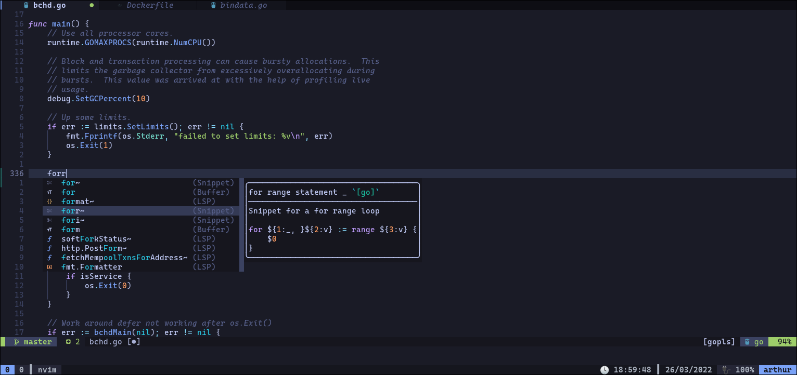

### Linters
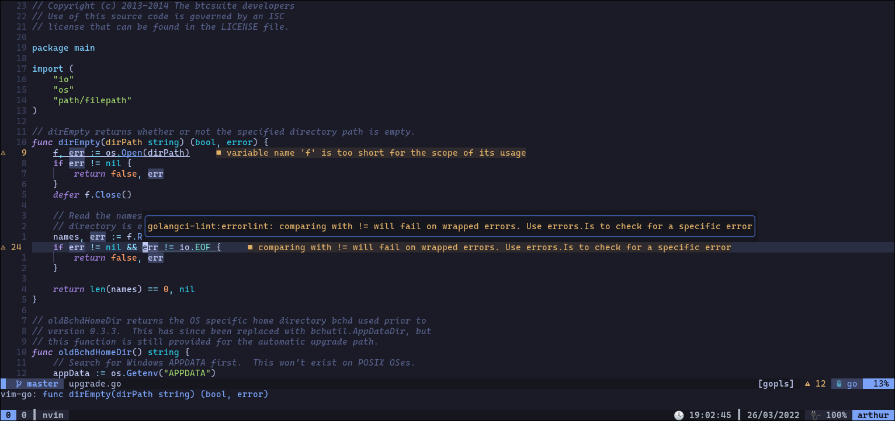

### Quickfix List (`<Space>l`)
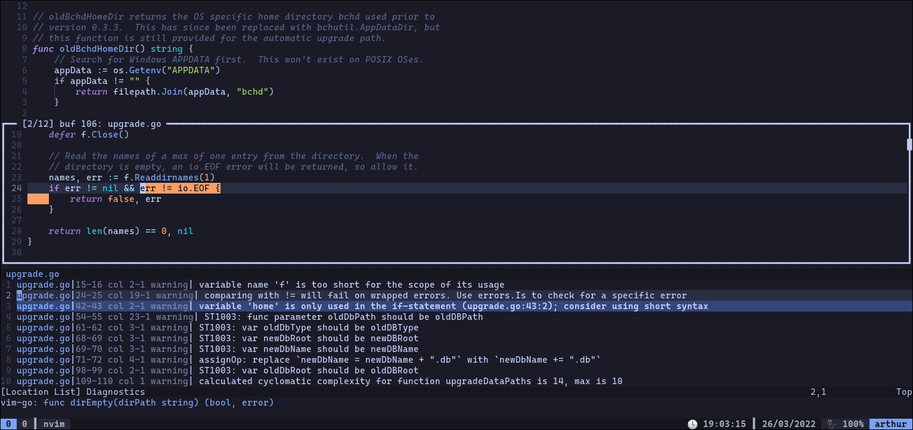

### Find Files (`<Space>f`)
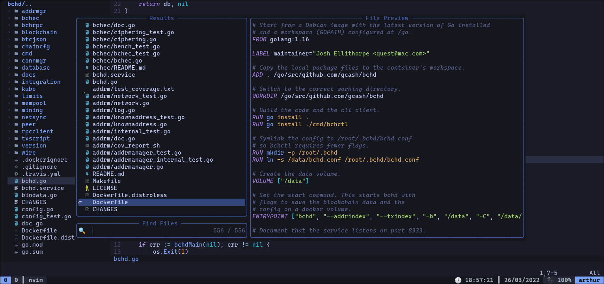

### Find Words (`<Space>j`)

### Split
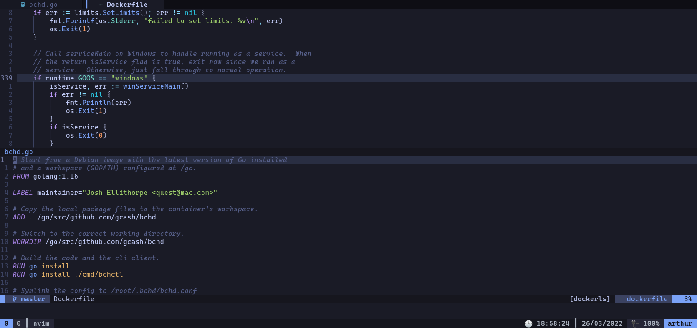

### Vsplit
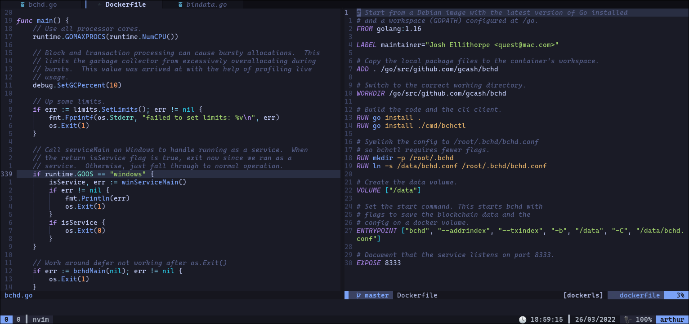

## Terminal
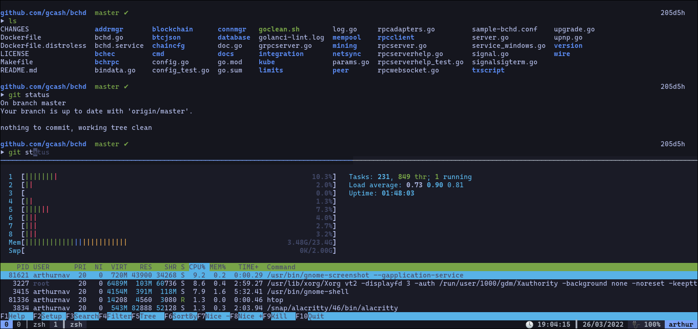
