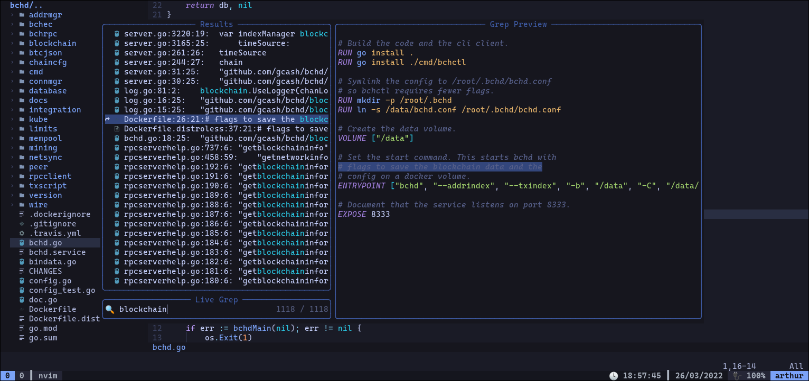

# Screenshots of the environment

## Vim

### Autocomplete

#### Autocomplete Signatures / Placeholders

### Hovers (`K`)

### Snippets

### Linters

### Quickfix List (`<Space>l`)

### Find Files (`<Space>f`)

### Find Words (`<Space>j`)

### Split

### Vsplit

## Terminal

